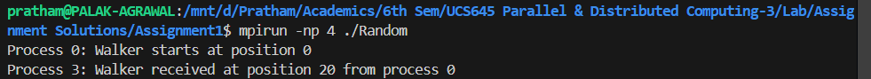

<h1>Parallel & Distributed Computing Assignments</h1>

<h2>Assignment 1</h2>
<ol>
    <li>
        MPI program to display "Hello World" message from multiple parallel processes
         
        
    </li>

    <li>
        MPI program to send and receive messages using MPI_Send() and MPI_Recv()
         
        
    </li>

    <li>
        MPI program to send and receive messages dynamically
         
        
    </li>

    <li>
        MPI program for Heat Distribution Simulation
         
        
    </li>
</ol>

 

 

<h2>Assignment 2</h2>
<ol>
    <li>
        Estimate value of pi using Monte-Carlo Method
         
        
    </li>

    <li>
        Matrix Multiplication time comparison for sequential and parallel
         
        
    </li>

    <li>
        Even-Odd sorting
         
        
    </li>

    <li>
        Heat Distribution Simulation
         
        
    </li>

    <li>
        Parallel Reduction using MPI
         
        
    </li>

    <li>
        Parallel Dot Product using MPI
         
        
    </li>

    <li>
        Parallel Prefix Sum using MPI
         
        
    </li>

    <li>
        Parallel Matrix Transposition using MPI
         
        
    </li>
</ol>