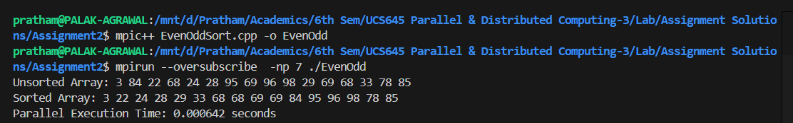
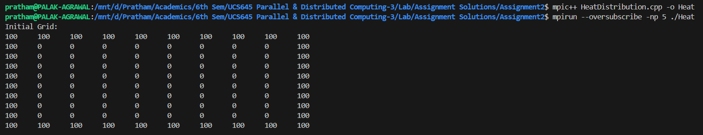
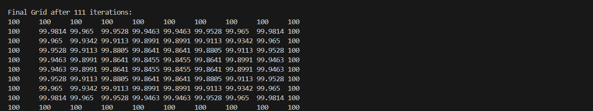
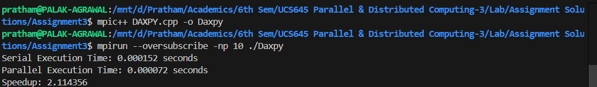
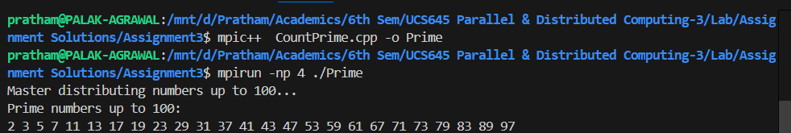
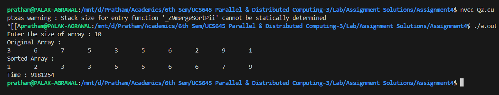
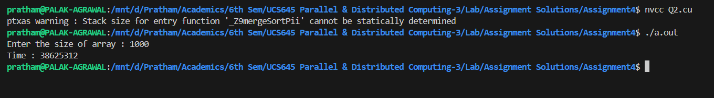

<h1>Parallel & Distributed Computing Assignments</h1>
<h2>Assignment 1</h2>
<ol>
    <li>MPI program to display "Hello World" message from multipl parallel processes</li>
    
    <li>MPI program to send and receive message using MPI_Send() and MPI_Recv()</li>
    
    <li>MPI program to send and receive message dynamically</li>
    
    <li>MPI program to implement Random Walking</li>
    
</ol>

 
<h2>Assignment 2</h2>
<ol>
    <li>Estimate value of pi using Monte-Carlo Method</li>
    
    <li>MatrixMultiplication time comparison for sequential and parallel</li>
    
    <li>Even-Odd sorting </li>
    
    <li>Heat Distribution Simulation</li>
    
    
    <li>Parallel Reduction using MPI</li>
    
    <li>Parallel Dot Product using MPI</li>
    
    <li>Parallel Prefix Sum using MPI</li>
    
    <li>Parallel Matrix Transposition using MPI</li>
    
</ol>

 
<h2>Assignment 3</h2>
<ol>
    <li>DAXPY Operation</li>
    
    <li>Calculating Pi</li>
    
    <li>Counting Primes upto a range </li>
    
</ol>
<h2>Assignment 4</h2>
<ol>
    <li>Sum of first N natural numbers </li>
    
    <li>Parallel Merge Sort</li>
    
    
</ol>